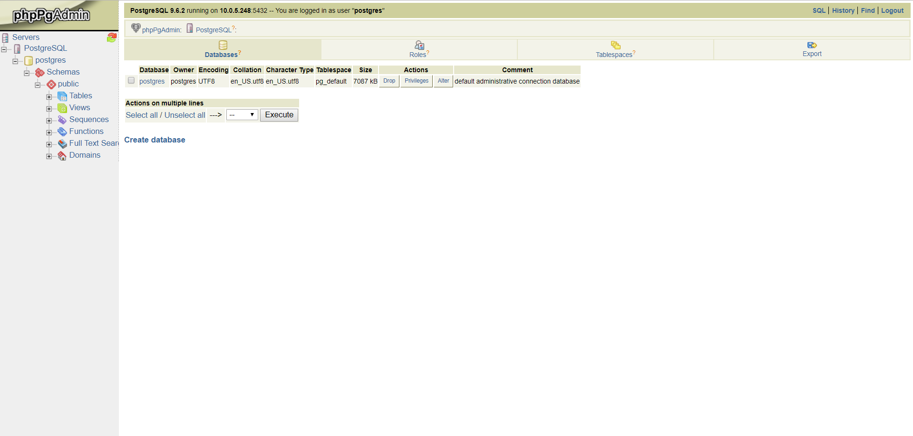

# phpPgAdmin
This is a Helm chart that deploys a phpPgAdmin instance to your Kubernetes cluster.

## Prerequisites
This install assumes you have an existing Kubernetes cluster installed and a [postgresql](https://github.com/kubernetes/charts/tree/master/stable/postgresql) instance deployed.

## Package
Once you've cloned this repo, you can create your helm package by running the following command in the repo's root directory:
```
helm package .
```

## Install
You now need to grab the ClusterIP of your PostgreSQL service.
```
kubectl get svc 
```
Filter through the list of services and grab the ClusterIP associated with your PostgreSQL service. Next you can install phpPgAdmin into your Kubernetes cluster by targeting your packaged archive:
```
helm install --set phppgadmin.serverHost={postgresql-clusterip},phppgadmin.serverPost={postgresql-port} phppgadmin-chart-0.1.0.tgz
```
The deployment will take a little while to provision a public IP for the service. You can watch for this using the following command:
```
kubectl get svc -w -l app=phppgadmin-chart
```

## Configure
When the deployment has finished and you have an external IP for your phpPgAdmin service, you can go to the phpPgAdmin web portal at `http://{phpPgAdmin-externalip}:8080/`.

Once web portal has loaded, you'll need to authenticate a new connection to your PostgreSQL database by clicking on the `Servers` tab.

